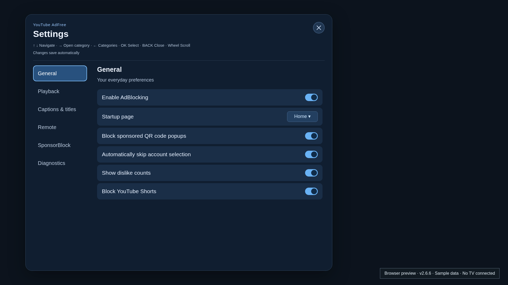
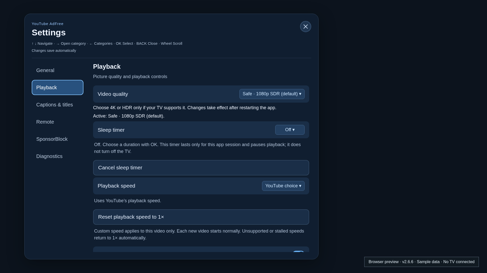
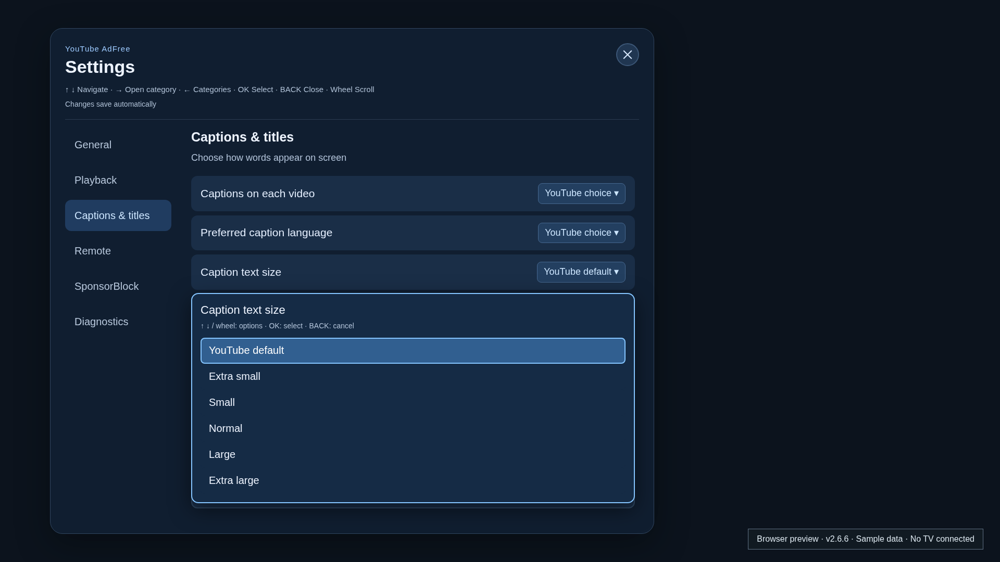
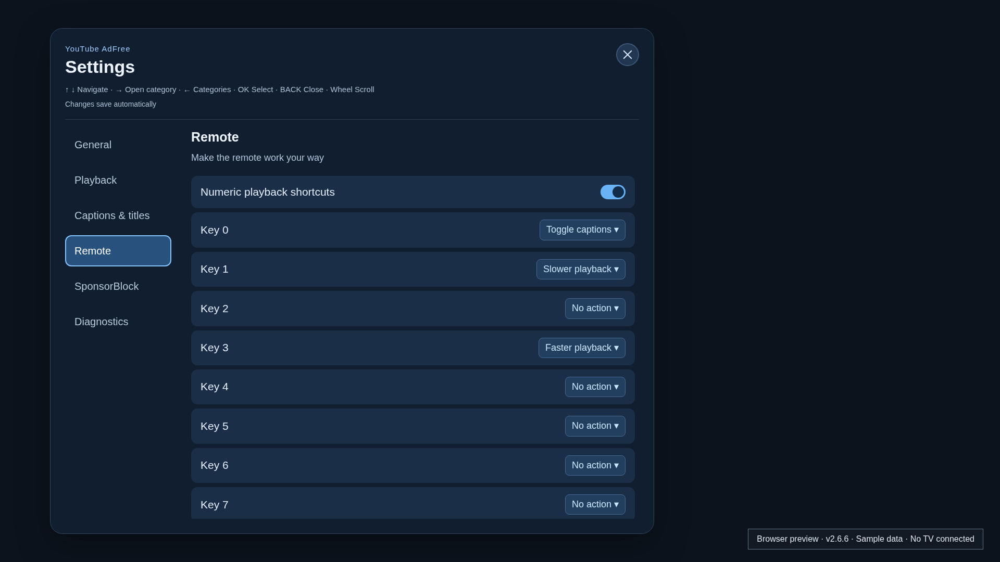
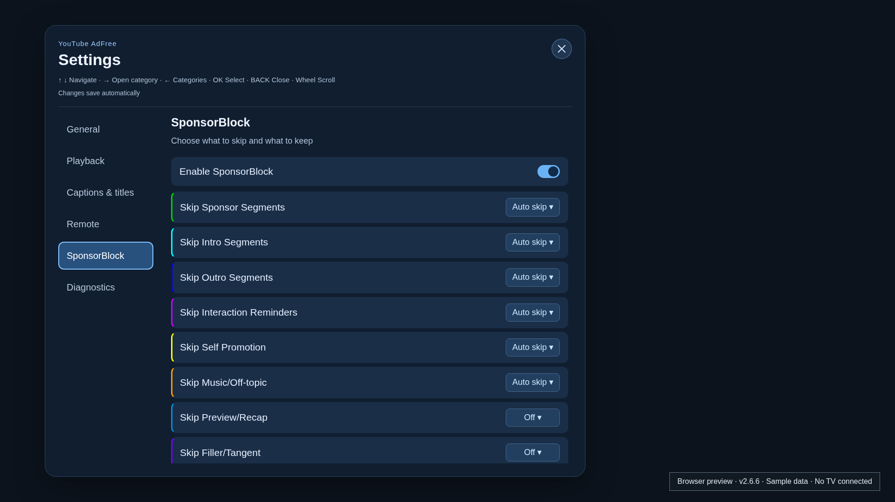
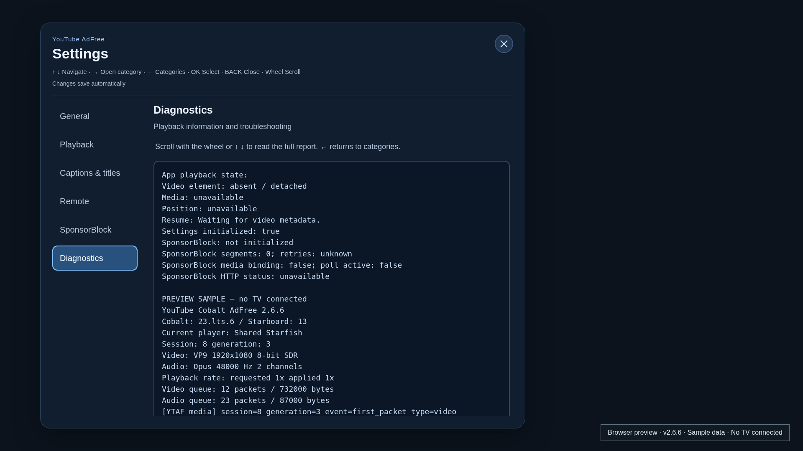

# YouTube webOS Cobalt AdFree

A YouTube TV app for LG webOS with ad blocking, SponsorBlock and extra playback controls. No root required for normal use.

Based on **[RF1705/youtube-webos-cobalt-adfree](https://github.com/RF1705/youtube-webos-cobalt-adfree)**. Credit to the original project and contributors for the starterless Cobalt/webOS runtime, ad blocking, SponsorBlock and YouTube TV integration. The in-place Home-refresh command is adapted from [NicholasBly/youtube-webos](https://github.com/NicholasBly/youtube-webos).

## Download and install

**[Latest release: v2.6.21-beta.1](https://github.com/danzig666/youtube-webos-cobalt-adfree/releases/tag/v2.6.21-beta.1)**

| Package | Download | Behavior |
| --- | --- | --- |
| Separate ID · `com.cobalt.youtube.adfree` | [IPK](https://github.com/danzig666/youtube-webos-cobalt-adfree/releases/download/v2.6.21-beta.1/com.cobalt.youtube.adfree_2.6.21_arm.ipk) | Installs alongside official YouTube |
| Original ID · `youtube.leanback.v4` | [IPK](https://github.com/danzig666/youtube-webos-cobalt-adfree/releases/download/v2.6.21-beta.1/youtube.leanback.v4_2.6.21_arm.ipk) | **Replaces official YouTube** |

Install using webOS Device Manager or `ares-cli` with Developer Mode, or Homebrew Channel on a compatible setup. Update the same package ID you already use, then fully close and reopen the app. Checksums and build records accompany each release.

Both variants have identical features and separate storage. YouTube sign-in remains available; **separate-ID sign-in/phone pairing are not TV-verified**. Use this fork’s separate-ID IPK to keep official YouTube.

## Features added in this fork

The original ad blocking, Return YouTube Dislike, automatic account selection, startup-page choice, Shorts toggle and sponsored QR blocking remain available.

| Addition | What it does |
| --- | --- |
| Blue settings interface | Inter typography, TV-safe margins, instant category switching on focus/hover, visible focus and direct option lists |
| Home refresh | YouTube’s in-place soft-refresh command, available in General and on number keys; confirmed working on the LG C3 |
| Magic Remote support | Cursor selection and wheel scrolling in settings, option lists, help and diagnostics |
| Video quality profiles | Safe 1080p SDR, 4K SDR or 4K HDR; saved on the TV and applied after a full restart |
| SponsorBlock category actions | Auto skip, Ask first, Markers only or Off for each category |
| Permanent channel exceptions | Disable all SponsorBlock skipping for a channel; manage and remove saved exceptions |
| Playback resume | YouTube watch history, resume during loading from confirmed session progress, and optional persistent TV fallback |
| Quick seeking | Optional 10-second Left/Right steps applied 0.5, 0.8 or 1 second after release; repeated taps combine into one seek, with a target marker and timestamp |
| Playback speed and reset | 0.5×–2× for the current video, progress monitoring, failure recovery to 1× and a dedicated reset action |
| Corner clock | Optional plain white clock in menus and with the seekbar; shifts slightly every three minutes and hides during clean playback |
| Thumbnail progress | Updates the watched video’s red thumbnail bar on return without refreshing or rearranging the feed |
| Sleep timer | Pause after 15, 30, 60 or 90 minutes, with countdown and cancellation |
| Stop after this video | Hold subsequent autoplay paused until Continue playback |
| Configurable remote keys | Separate action selectors for keys 0–9, optional shortcuts and built-in remote help |
| Caption preferences | Startup on/off behavior, preferred language, six text-size choices including YouTube default, and a thin black outline around custom-size letters |
| Optional DeArrow | Community titles or titles and thumbnails; off by default, with a temporary Show originals action |
| Scrollable diagnostics | App/runtime versions, capability policy, codecs, rates, queues, resume/SponsorBlock state, Home-refresh reasons and bounded playback events |
| TV capability test | Read-only LG panel/UHD/OLED/HDR flags and optional Starfish decoder limits; configured Cobalt support is shown separately |
| Durable preferences | Private per-install saves, migration from older browser settings and visible save-failure feedback |
| Two installable variants | Original-ID and separate-ID IPKs with matching runtime identities, build records and SHA-256 checksums |

Press **GREEN** to open settings. Use arrows and **OK**, the cursor or the wheel; **BACK** cancels an option list first, then closes settings without closing the video. Default numeric shortcuts: **0** captions, **1** slower, **3** faster. Assign **Reset playback speed to 1×** or **Refresh Home recommendations** under Remote. Home refresh works only on Home. Refresh sends YouTube’s `SOFT_RELOAD_PAGE` command, using the method from NicholasBly’s app; it does not require opening the sidebar. Older runtimes without the event API can use a sidebar round trip. YouTube decides which recommendations are returned.

Use **Diagnostics → Run capability test** to inspect the TV’s reported panel/HDR flags and decoder limits in the existing scrolling log. The test uses ordinary LS2 client queries and explains denied/empty replies. Identical decoder ceilings are not proof of panel resolution or HDR. Missing fields stay unknown; the test changes no settings. See [test details](docs/tv-capability-test.md).

Choose a quality profile your TV supports; restart to apply it. Custom speeds require shared A/V and reset each video. Resume gives YouTube watch history priority: sign in and keep history enabled for account synchronization. Within the current app session, reopening a video also uses the confirmed position behind its red thumbnail bar if YouTube supplies none. This transient cache does not survive an app restart. Optional TV fallback gives YouTube priority and keeps up to 100 unfinished VODs for 90 days, excluding live/DVR and Shorts. Clearing TV bookmarks does not clear account history. Timers pause playback, not the TV.

YouTube default restores native caption styling. DeArrow sends visible video IDs to public services when enabled. Backup/restore and the separate comments reader are excluded; use YouTube’s comments.

## Fixes and playback hardening

- **Home refresh:** fixed the silent Home-detection failure caused by Cobalt lacking `URL.searchParams`; Home detection uses its supported query-string interface. Removed the full-reload button, shortcut and code; saved full-reload assignments become No action. Added the reference `SOFT_RELOAD_PAGE` command and corrected Home detection for current `FEtopics` alongside the older `FEwhat_to_watch`.

- **Clock:** raised to 2% from the top edge to clear the YouTube logo; OLED movement stays upward. Fixed visibility and recovery; removed the dark box, added a small three-minute position shift and hid it during playback when menus and the seekbar are down.
- **Thumbnail progress:** uses confirmed playback to update matching cached thumbnails on return; preserves card order, selection and scroll, with no feed refresh or account API.
- **Fonts:** moved Inter from embedded data URLs to installed font files after reproducing a security-policy rejection. Both weights load under the restricted browser test; C3 appearance still needs confirmation.
- **Settings:** fixed adblock preference saving, malformed configuration recovery, BACK closing the video, the off-centre close icon, the empty blue notification pill and QR controls appearing on every category.
- **Option lists:** fixed cursor selection, open/close flicker, stale popups after category changes, duplicate key/mouse activation and clicks passing through to underlying switches. Remote keys now have individual selectors.
- **Captions:** fixed styles not activating on Cobalt, sizes being overwritten by YouTube and competing font-size updates. Added smaller sizes, stable sizing across cue replacement, measured feedback and the thin outline without a black bar.
- **Seeking and resume:** fixed stale targets across repeated seeks and early resume requests being lost before metadata or seekable ranges exist. Automatic seeks show the target before revealing controls, survive timeline redraws and wait after key release. Resume verifies late YouTube targets, preserves partial metadata and prevents local retries or unconfirmed DOM timestamps from replacing valid progress. Reopened videos now queue the confirmed thumbnail position during loading, removing the delay after playback starts; constant-URL page transitions reset stale resume state.
- **Speed:** added native policy/feedback, idempotent rate changes, deferred application until playback starts, stall detection and 1× recovery/reset without retaining a broken speed across videos.
- **UI recovery and SponsorBlock:** fixed stale settings/picker OK states and pointer/mouse click completion; added guarded hidden-player controls reveal; restored settings if YouTube removes their node, preserved native text/video layout behavior, rebound replaced media elements and added bounded retries after transient segment-fetch failures.
- **Native media:** centralized conservative capabilities; separated generic shared audio state from Opus timing; added idempotent lifecycle handling, typed errors and bounded tracing. Expanded queue, generation, EOS, overflow, transition and seek tests. Fixed legacy configuration admission, asynchronous startup and timestamp bounds.
- **Diagnostics and packaging:** replaced paged reports with one scrollable textbox and removed unusable clipboard copy. Fixed MSE trace attribution/error handling, dependency inspection, runtime-library inclusion and non-root package permissions.
- **Development:** added SDK-free native host tests, a scheduled full Gold ARM build workflow, device-report templates and a compatibility-matrix generator. Scheduled builds activate on the default branch; they do not publish stable releases.

The LG C3 user confirmed caption sizing/cursor selection in 2.6.5 and in-place Home refresh in 2.6.11. The user also confirmed cached resume in 2.6.17. Version 2.6.18 queues that position during loading to remove the delay after playback starts. Version 2.6.19 adds the read-only TV capability test; C3 returned identical Starfish ceilings but unreadable LG command replies. Version 2.6.20 exposed a C3 -1031 privilege rejection; 2.6.21 removes app-ID forwarding by using ordinary LS2 calls and raises the clock. The report names failure stages/codes and labels shared decoder ceilings. The current release passes browser checks, 322 web tests, native host regressions and both ARM builds. The capability queries still need TV validation. **Clock and thumbnail rendering, playback resume, fractional speeds, live/DVR, HDR, lifecycle recovery and intermittent disappearing controls still need device validation; the controls issue is not confirmed resolved.** AAC retains its existing decoder path; legacy playback and `YTAF_SHARED_AV=0` rollback remain available.

## Screenshots

Settings UI from 2.6.6, captured in Chromium at 1920×1080: **browser previews, not TV captures**, with a neutral backdrop and labelled sample native data. Click to enlarge.

| General | Playback |
| --- | --- |
| [](screenshots/current/general.png) | [](screenshots/current/playback.png) |
| **Captions and titles** | **Remote keys** |
| [](screenshots/current/captions.png) | [](screenshots/current/remote.png) |
| **SponsorBlock** | **Diagnostics · sample data** |
| [](screenshots/current/sponsorblock.png) | [](screenshots/current/diagnostics.png) |

## Development

Cobalt **23.lts.6**, Starboard **13**, custom webOS/SDL/Starfish platform; no proprietary LG starter required.

```sh
git clone --branch playback/host-tested-v2 https://github.com/danzig666/youtube-webos-cobalt-adfree.git
cd youtube-webos-cobalt-adfree
npm --prefix webapp ci
npm --prefix webapp test
npm --prefix webapp run build -- --env production
```

Native checks: `bash scripts/test-native-host.sh /path/to/disposable-cobalt-23.lts.6` (prepares that checkout). Build/package helpers: [Cobalt build](scripts/build-starterless-cobalt-docker.sh), [SDL build](scripts/build-sdl-webos-docker.sh), [IPK packaging](scripts/package-starterless-cobalt.sh). Keep `YTAF_PACKAGE_ID` identical for native build and packaging.

Details: [playback plan](docs/v2-playback-improvement-plan.md) · [build validation](docs/full-gold-build-validation.md) · [usability](docs/usability-improvements.md) · [caption/DeArrow integration](docs/caption-dearrow-integration.md) · [C3 playback follow-up](docs/c3-playback-followup.md) · [device reports](docs/device-compatibility-v2.md).

Report your TV model, webOS/firmware, app version and package ID in [Issues](https://github.com/danzig666/youtube-webos-cobalt-adfree/issues). Hardware support varies by TV and firmware.

Unofficial project; not affiliated with YouTube, Google, LG or webOS. Upstream projects and bundled components retain their respective licensing terms.
